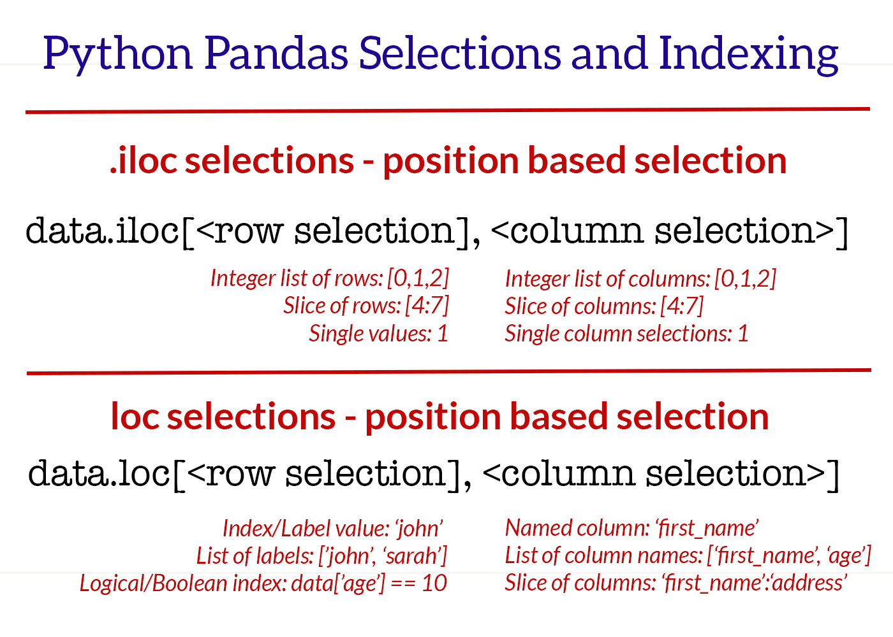

# Pandas and ML Cheat Sheet

## Table of Contents

- [Installation](#installation)
- [Creating DataFrames](#creating-dataframes)
- [Inspecting Data](#inspecting-data)
- [Selecting](#selecting)
- [Modifying Data](#modifying-data)
- [Handling Missing Data](#handling-missing-data)
- [Handling Outliers](#handling-outliers)
- [Sorting and Grouping](#sorting-and-grouping)
- [Merging and Joining DataFrames](#merging-and-joining-dataframes)
- [Exporting Data](#exporting-data)
- [References](#references)

## Installation

```bash
pip install pandas
```

```python
import pandas as pd
```

## Creating DataFrames

```python
# From a dictionary
data = {
    'Name': ['Alice', 'Bob', 'Charlie'],
    'Age': [25, 30, 35]
    }
df = pd.DataFrame(
    data,
    index=[1,2,3])

# From an array
data = [
    ['Alice', 25],
    ['Bob' , 30],
    ['Charlie' , 35]]
df = pd.DataFrame(
    data,
    index=[1,2,3],
    columns=['Name', 'Age'])

# From a CSV file
df = pd.read_csv("data.csv")

# From an Excel file
df = pd.read_excel("data.xlsx")
```

## Inspecting Data

```python
df.head()  # First rows
df.tail()  # Last rows
df.sample()  # Random row selection
df.info()  # Summary of DataFrame
df.dtypes  # Data Types
df.describe()  # Summary statistics
df.shape  # Dimensions
df.columns  # Columns
df['sex'].value_counts(dropna=False)  # Unique values count repeat count
df['sex'].value_counts(normalize=True) * 100  # Percentage
pd.crosstab( titanic_data.sex, titanic_data.survived)
# tip: normalize="index" or "columns" or "all"
df.unique()  # Unique values only
```

## Selecting

```python
df['Age']  # Select a column
df[['Name', 'Age']]  # Select multiple columns

# ____ Filter rows ____
titanic_data[
    (titanic_data.age <= 5) &
    (titanic_data.survived == 1)]

titanic_data[
    titani_datac.name.str.contains('Allen')
    ]
titanic_data[titanic_data.age.isnull()]

# ____ Slicing ____
df[0:10]

# ____ iloc ____
df.iloc[0]  # Select first row by index
df.iloc[0, 1, 2]  # Select 0, 1, and 2 row

# rows from 0 to 9
# columns from 0 to 2
df.iloc[0:10, 0:3]

df.iloc[:, 0:3]  # All rows and 0 to 2 columns

cols = [True, True, False, False, True, False]
df.iloc[: , cols] # Only True cols


df.loc[0, 'Name']  # Select specific value
df.loc[['name1', 'name2'], ['col1', 'col2']]


# ____ Query ____
df.query('survived == 1 and age >= 10')
```



## Modifying Data

```python
df['Age'] = df['Age'] + 1  # Modify a column
df['NewColumn'] = df['Age'] * 2  # Add a new column

# Remove column
df.drop(columns=['NewColumn'], inplace=True)
# Rename a column
df.rename(columns={'Age': 'Years'}, inplace=True)
```

## Handling Missing Data

```python
df.dropna()  # Remove missing values
df.fillna(0)  # Fill missing values with 0
df.isna().sum()  # Count missing values per column
```

## Handling Outliers

```python
# Calculate Q1 (25th percentile) and Q3 (75th percentile) for the Price column
Q1 = cdf['Feature'].quantile(0.25)
Q3 = cdf['Feature'].quantile(0.75)

# Calculate the IQR (Interquartile Range)
IQR = Q3 - Q1

# Define lower and upper bounds for normal price values
lower_bound = Q1 - 1.5 * IQR
upper_bound = Q3 + 1.5 * IQR

# Create a new column to flag outliers
cdf['Feature_Outlier'] = ((cdf['Feature'] < lower_bound) | (cdf['Feature'] > upper_bound))

# Remove the outliers from the original data
cdf = cdf[~cdf['Feature_Outlier']]

# Drop the Outlier column if you no longer need it
cdf = cdf.drop(columns=['Feature_Outlier'])
print(f"Number of rows after removing outliers: {cdf.shape[0]}")
```

## Sorting and Grouping

```python
df.sort_values('Age', ascending=False)  # Sort by Age descending
df.groupby('Name').mean()  # Group by Name and compute mean
```

## Merging and Joining DataFrames

```python
df1.merge(df2, on='ID', how='inner')  # Inner join
df1.merge(df2, on='ID', how='left')  # Left join
df1.append(df2, ignore_index=True)  # Append rows
```

## Exporting Data

```python
df.to_csv("output.csv", index=False)  # Save as CSV
df.to_excel("output.xlsx", index=False)  # Save as Excel
```

## References

- [Pandas Documentation](https://pandas.pydata.org/docs/)
